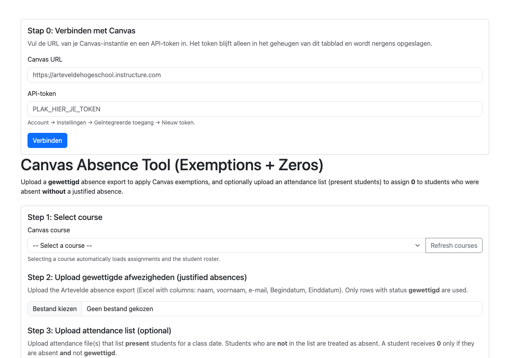

# Afwezigheden, vrijstellingen en nulopzetten

Blazor-webapp die een **gewettigd**-afwezighedenexport uit Excel leest en in
Canvas per opgave een vrijstelling (`excuse`) zet. Optioneel zet hij ook een **0**
voor studenten die afwezig waren zonder wettiging, op basis van een
aanwezigheidslijst.

Dit is een .NET-project en dus de uitzondering op de conventies van deze repo:
het heeft een build-stap nodig. Zie de [conventies](../README.md#conventies).

Dit was eerst één app met drie pagina's. De andere twee staan nu los:

- [`canvas-afspraaksloten/`](../canvas-afspraaksloten/) — wie er in jouw
  afspraaksloten zaten, met hun cijfer.
- [`canvas-bamaflex-export/`](../canvas-bamaflex-export/) — eindcijfers
  exporteren naar Excel voor BamaFlex.

## Schermafbeeldingen



Dat is het scherm waarmee je begint: URL en token invullen en op **Verbinden**
klikken. De upload en de lijst met opgaven verschijnen pas na een geslaagde
verbinding.

## Vereisten

- **.NET 10 SDK** of later. Controleer met `dotnet --version`.
- Internet bij de eerste start: `dotnet run` haalt EPPlus en Newtonsoft.Json op
  van NuGet.
- Een Canvas-account met een API-token.

## Starten

```bash
cd canvas-afwezigheden-vrijstellingen
dotnet run
```

Open http://localhost:5000

Er is geen installatiestap en geen configuratiebestand nodig. `appsettings.json`
is optioneel: wil je standaard een instantie-URL of voorgeselecteerde cursus,
kopieer dan `appsettings.example.json` naar `appsettings.json` en vul die in.
Dat bestand staat in `.gitignore`.

## Verbinden

De eerste keer begint elke pagina met **Stap 0: Verbinden met Canvas**:

1. Vul de URL van je instantie in, bijvoorbeeld
   `https://arteveldehogeschool.instructure.com`. `/api/v1` mag erbij, dat wordt
   afgeknipt.
2. Plak je API-token in het tokenveld.
3. Klik op **Verbinden**. De app doet meteen een `GET /users/self` om te
   controleren of de URL en het token kloppen, en toont daarna met welke
   account je verbonden bent.

Het token wordt **nooit naar schijf geschreven**. Het leeft alleen in het geheugen
van het serverproces, in het geheugen van je browsertabblad. Sluit je het tabblad,
dan ben je het kwijt en moet je het opnieuw plakken. Dat is met opzet zo: er staat
geen token in een bestand in de repo.

De app luistert standaard op `localhost` en is niet bereikbaar vanaf andere
machines. Wil je dat toch, gebruik dan `dotnet run --urls http://0.0.0.0:5000`
en weet wat je doet: het token staat dan in het geheugen van een bereikbare
dienst.

## Afwezigheden en nulopzetten

De flow op de eerste pagina:

1. Kies een cursus. De cursussen komen uit je eigen inschrijvingen.
2. De opgaven worden opgehaald. Zet per opgave de **Inleverdatum**: dat is de
   datum waarop de afwezigheid en de aanwezigheid van toepassing zijn. Het is
   niet noodzakelijk de Canvas-deadline.
3. Upload de afwezighedenexport. Alleen rijen met status **gewettigd** worden
   gebruikt.
4. Zet de vrijstellingen. Per opgave kun je ook een eigen Inleverdatum per
   klas/sectie instellen; vink dan het vakje *By class* aan.
5. Optioneel: upload een aanwezigheidslijst en klik op **Load Students** om de
   roosterijst van de cursus op te halen.
6. Zet de nullen voor studenten die afwezig waren zonder wettiging.

**Standaard staat simulatie aan.** In simulatiemodus verandert er niets in Canvas
en zie je alleen wat er zou gebeuren. Zet het uit om het echt te doen.

## Indeling van de afwezighedenexport

Een Excel-bestand uit de Artevelde-export, met de koptekst op **rij 5** en de
gegevens vanaf **rij 6**. De kolommen worden op positie gelezen, niet op naam:

| Kolom | Inhoud |
| --- | --- |
| A | naam (achternaam) |
| B | voornaam |
| C | e-mail |
| D | Begindatum |
| E | Einddatum |
| F | Opmerking |
| G | Status wettiging |
| H | Reden |

- Alleen rijen waarvan kolom G **gewettigd** bevat worden meegenomen.
- Het student-id is het stuk vóór de `@` van het e-mailadres. Dat wordt op de
  roosterijst van de cursus teruggezocht.
- Uit Begindatum en Einddatum wordt voor elke dag in dat bereid een afwezigheid
  gemaakt, beide dagen inclusief.
- De Reden wordt als reden van de afwezigheid meegenomen.

## Indeling van de aanwezigheidslijst

Een "aanwezig"-lijst, bijvoorbeeld een Microsoft Forms-export. De app zoekt in
de eerste 20 rijen naar de kolomkoppen en gebruikt:

| Kolomkop | Alternatief | Gebruik |
| --- | --- | --- |
| `E-mail` | `Email` | verplicht, bepaalt de headerrij |
| `Begintijd` | `Start time` | verplicht, bepaalt welke dag |
| `Naam` | `Name` | optioneel, alleen voor de weergave |

Rijen onder de koppingsrij zonder geldig e-mailadres worden overgeslagen. Wie in
de lijst staat, was aanwezig; wie in de roosterijst staat maar niet in de lijst,
was afwezig.

## Gedrag en veiligheid

- **Eerst simuleren.** Simulatie staat aan bij het opstarten, en elke knop meldt
  wat hij zou doen voordat er iets in Canvas verandert.
- **Herhalen is veilig.** Een student die al `excuse` heeft, wordt overgeslagen.
- Het `Inleverdatum`-veld is losgekoppeld van de Canvas-deadline, omdat een
  lesmoment en een inlevermoment vaak verschillen.
- Bij een nulopzetting zet de app `posted_grade=0` **en** `excuse=false`, anders
  negeert Canvas de nul bij een al verontschuldigde inlevering.
- De app doet niets met leerlingen buiten de gekozen cursus.

## API-calls die de app gebruikt

| Actie | Call |
| --- | --- |
| Verbinden controleren | `GET /api/v1/users/self` |
| Eigen cursussen | `GET /api/v1/courses?enrollment_state=active` |
| Opgaven ophalen | `GET /api/v1/courses/:id/assignments` |
| Klassen/secties | `GET /api/v1/courses/:id/sections` |
| Roosterijst | `GET /api/v1/courses/:id/users?enrollment_type[]=student` |
| Student terugzoeken | `GET /api/v1/courses/:id/users?search_term=` |
| Vrijstelling zetten | `PUT /api/v1/courses/:id/assignments/:aid/submissions/:uid` met `submission[excuse]=true` |
| Nul zetten | idem, met `submission[posted_grade]=0` en `submission[excuse]=false` |

Voor de lijst-endpoints volgt de app de `Link`-header met `rel="next"` in plaats
van `?page=1,2,3`, omdat Canvas daar bookmark-paginering voor gebruikt.

## API-token aanmaken

Het token is een sleutel die je zelf in Canvas aanmaakt. Het is los van je
wachtwoord en je kunt het op elk moment intrekken.

1. Open in Canvas je **Account**-pagina: klik linksonder op je naam, of op
   **Account** in de voettekst.
2. Kies **Instellingen** en daarna **Geïntegreerde toegang**.
3. Klik op **+ Nieuw token**.
4. Geef het een herkenbare naam, bijvoorbeeld `vrijstellingentool laptop`.
5. Klik **Token genereren** en **kopieer het meteen** — Canvas toont het token
   maar één keer.
6. Plak het in het tokenveld van de app en klik op **Verbinden**.

### Token intrekken

Ga terug naar **Instellingen → Geïntegreerde toegang** en klik op het
prullenbakje naast het token. Doe dat als je klaar bent, zeker als iemand anders
op dezelfde laptop heeft meegekeken.

### Benodigde reikwijdtes

Standaard mag een nieuw token alles binnen je eigen account. Je kunt het bij het
genereren beperken: zet het vinkje *Beperkte reikwijdte* en plak onderstaande
regels één per regel in het tekstveld.

```
url:GET|/api/v1/users/self
url:GET|/api/v1/courses
url:GET|/api/v1/courses/:course_id/assignments
url:GET|/api/v1/courses/:course_id/sections
url:GET|/api/v1/courses/:course_id/users
url:PUT|/api/v1/courses/:course_id/assignments/:assignment_id/submissions/:user_id
```

## Waar het token opgeslagen wordt

Nergens. Er is geen `.env` en geen `appsettings.json` met een token nodig. Het
token leeft in het geheugen van het serverproces zolang je tabblad open is, en
verdwijnt zodra de app gestopt is. `appsettings.json` en de varianten met
`Development`/`Production` staan in `.gitignore`, en
`appsettings.example.json` bevat alleen de URL en de cursor-ID.
