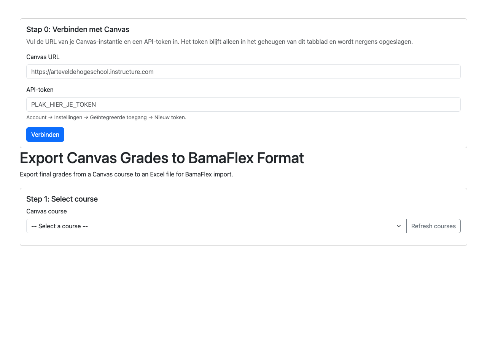

# Canvas Export naar BamaFlex

Blazor-webapp die de eindcijfers van een Canvas-cursus ophaalt en exporteert
naar een Excel-bestand in het formaat dat **BamaFlex** inleest. Daarna kun je
het bestand importeren in BamaFlex en hoeft de lijst niet over te typen.

Dit is een .NET-project en dus een uitzondering op de conventies van deze repo:
het heeft een build-stap nodig. Zie de [conventies](../README.md#conventies).

## Schermafbeeldingen



Dat is het scherm waarmee je begint: URL en token invullen en op **Verbinden**
klikken. De cursussen, de cijferlijst en de export verschijnen pas na een
geslaagde verbinding.

## Vereisten

- **.NET 10 SDK** of later. Controleer met `dotnet --version`.
- Internet bij de eerste start om de NuGet-pakketten op te halen.
- Een Canvas-account met een API-token.

## Starten

```bash
cd canvas-bamaflex-export
dotnet run
```

Open http://localhost:5000

Er is geen configuratiebestand nodig. `appsettings.json` is optioneel: wil je
standaard een instantie-URL of voorgeselecteerde cursus, kopieer dan
`appsettings.example.json` naar `appsettings.json`. Dat bestand staat in
`.gitignore`.

## Verbinden

De pagina begint met **Stap 0: Verbinden met Canvas**:

1. Vul de URL van je instantie in, bijvoorbeeld
   `https://arteveldehogeschool.instructure.com`. `/api/v1` mag erbij, dat wordt
   afgeknipt.
2. Plak je API-token in het tokenveld.
3. Klik op **Verbinden**. De app doet meteen een `GET /users/self` om te
   controleren of de URL en het token kloppen.

Het token wordt **nooit naar schijf geschreven**. Het leeft alleen in het geheugen
van het serverproces, in het geheugen van je browsertabblad. Sluit je het tabblad,
dan is het kwijt.

De app luistert standaard op `localhost` en is niet bereikbaar vanaf andere
machines.

## Gebruik

1. Kies een cursus.
2. De eindcijfers worden opgehaald en getoond in een tabel.
3. Controleer de lijst, en klik op **Export to BamaFlex Excel Format**.
4. Het bestand `BamaFlex_Grades_Course_<cursusid>_<datum>.xlsx` wordt gedownload.

De tabel toont vier kolommen: studentnummer, naam, e-mail en het eindcijfer op
20 punten. Controleer de cijfers voordat je importeert; de tool rekent niets
zelf om dat het lijkt.

## Het Excel-bestand

Eén werkblad `Grades`, met op rij 1 de vetgedrukte kolomkoppen en daarna één
rij per student:

| Kolom | Inhoud |
| --- | --- |
| A | Studentnummer |
| B | Naam |
| C | E-mail |
| D | Score |

De kolombreedtes worden automatisch gezet. De bestandsnaam bevat de cursus-ID
en de datum, zodat meerdere exports naast elkaar kunnen staan.

## Gedrag

- Alleen **actieve** studentinschrijvingen (`type=StudentEnrollment`,
  `state=active`) worden meegenomen. Wie is uitgeschreven of uit de cursus
  verwijderd, staat er dus niet in.
- **Het studentnummer** wordt bepaald in deze volgorde: het stuk vóór de `@` van
  het e-mailadres, anders het stuk vóór de `@` van de login, anders het
  SIS-nummer, anders de login, anders het numerieke Canvas-id. Dat is
  bewust dezelfde volgorde als de andere tools in deze repo, zodat bestanden op
  dezelfde manier herkenbaar blijven.
- **De score** komt uit `final_score` en valt terug op `current_score`. Hij wordt
  omgerekend naar een schaal van 20 als hij boven de 20 ligt, want Canvas
  rapporteert meestal een percentage. Die omrekening is een heuristiek: controleer
  een uitschieter.
- De letterlijke eindcijfer-letter (`final_grade`) wordt wel opgehaald, maar
  staat **niet** in het Excel-bestand. Het BamaFlex-formaat heeft daar geen kolom
  voor.
- Studenten zonder cijfer krijgen een leeg veld in de export.

## API-calls die de app gebruikt

| Actie | Call |
| --- | --- |
| Verbinden controleren | `GET /api/v1/users/self` |
| Eigen cursussen | `GET /api/v1/courses?enrollment_state=active` |
| Cijfers per inschrijving | `GET /api/v1/courses/:id/enrollments?type[]=StudentEnrollment&state[]=active&include[]=user` |
| Studentnummer en e-mail | `GET /api/v1/courses/:id/users?enrollment_type[]=student&include[]=email` |

De tool haalt de cijfers en de studentgegevens uit twee apartelijke lijsten en
koppelt die op het Canvas-`user_id`. Voor de lijst-endpoints volgt de app de
`Link`-header met `rel="next"` in plaats van `?page=1,2,3`, omdat Canvas daar
bookmark-paginering voor gebruikt.

## API-token aanmaken

Het token is een sleutel die je zelf in Canvas aanmaakt. Het is los van je
wachtwoord en je kunt het op elk moment intrekken.

1. Open in Canvas je **Account**-pagina: klik linksonder op je naam, of op
   **Account** in de voettekst.
2. Kies **Instellingen** en daarna **Geïntegreerde toegang**.
3. Klik op **+ Nieuw token**.
4. Geef het een herkenbare naam, bijvoorbeeld `bamaflex export laptop`.
5. Klik **Token genereren** en **kopieer het meteen** — Canvas toont het token
   maar één keer.
6. Plak het in het tokenveld van de app en klik op **Verbinden**.

### Benodigde reikwijdtes

Standaard mag een nieuw token alles binnen je eigen account. Je kunt het
beperken: zet het vinkje *Beperkte reikwijdte* en plak onderstaande regels één per
regel in het tekstveld.

```
url:GET|/api/v1/users/self
url:GET|/api/v1/courses
url:GET|/api/v1/courses/:course_id/enrollments
url:GET|/api/v1/courses/:course_id/users
```

### Token intrekken

Ga terug naar **Instellingen → Geïntegreerde toegang** en klik op het
prullenbakje naast het token.

## Waar het token opgeslagen wordt

Nergens. Er is geen `.env` en geen `appsettings.json` met een token nodig. Het
token leeft in het geheugen van het serverproces zolang je tabblad open is, en
verdwijnt zodra de app gestopt is. Het geëxporteerde Excel-bestand bevat
studentgegevens en cijfers, dus die bewaar je zelf en gooi je weg als je klaar
bent.
